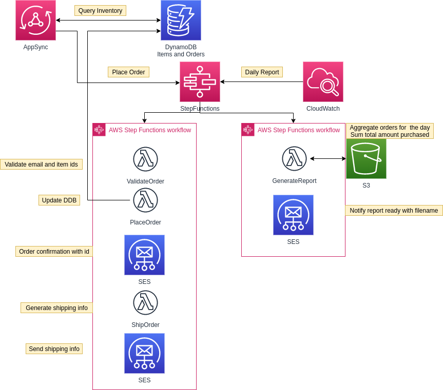

## A Simple Shop Workflow

Manages an inventory of items and order details.

When an order is placed it updates inventory counts and sends a confirmation email.
Then it also creates a shipping label and sends an email with shipping information.

